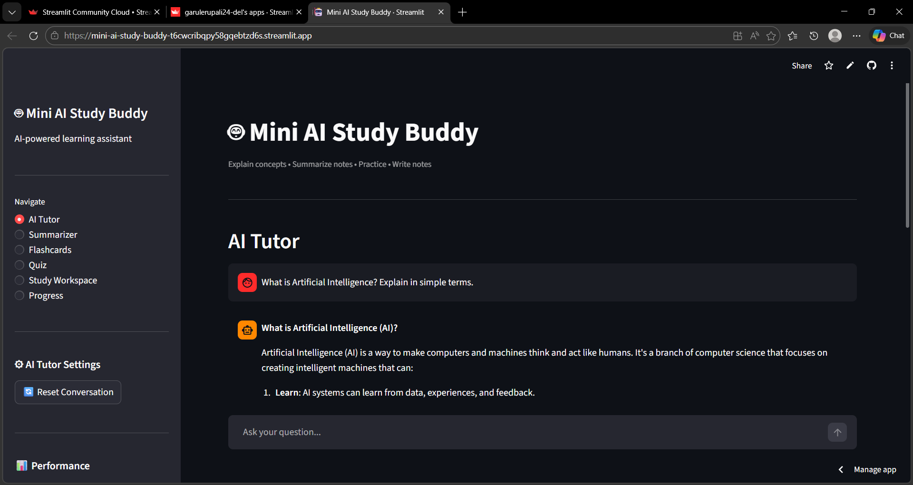
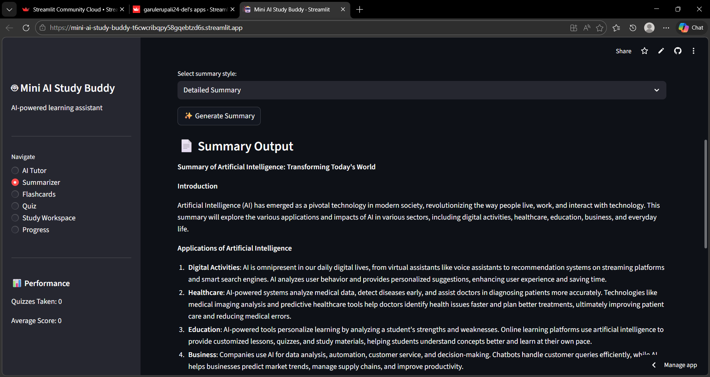
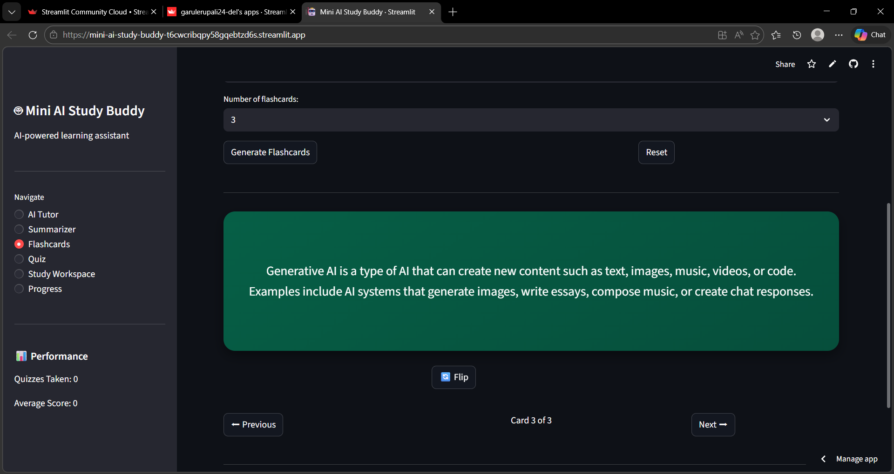
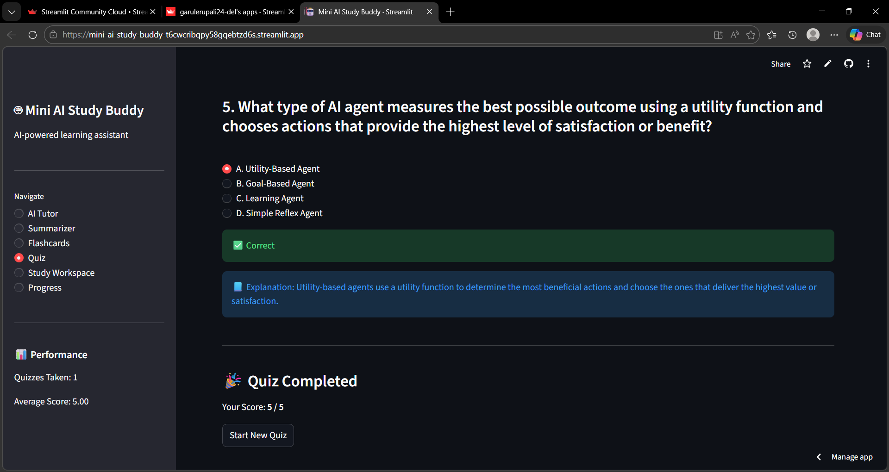
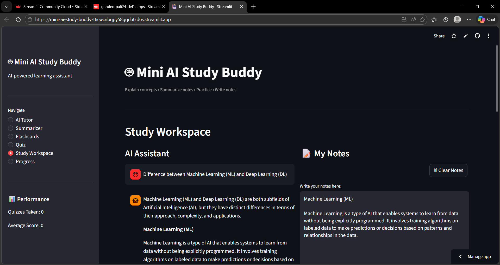
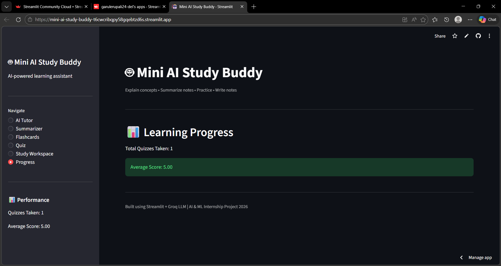

Mini AI Study Buddy

Mini AI Study Buddy is an AI-powered learning assistant designed to help students understand complex concepts, summarize study notes, generate flashcards, and practice quizzes for more effective self-study. The application integrates multiple AI-driven tools into a single platform to support interactive and personalized learning.

This project was developed as part of the Artificial Intelligence and Machine Learning Internship Program conducted by Edunet Foundation in collaboration with the All India Council for Technical Education (AICTE).

Key Functionalities

AI Tutor

Allows students to ask questions and receive AI-generated explanations.

Maintains conversation history for better contextual responses.

Includes an option to reset the conversation.

Notes Summarizer

Converts lengthy study notes into concise summaries.

Helps students revise key concepts efficiently.

Flashcards Generator

Automatically generates flashcards from study material.

Supports quick revision and memorization.

Quiz Generator

Creates multiple-choice quizzes from study content.

Tracks scores and student performance.

Study Workspace

Provides an AI assistant alongside a note-taking interface.

Allows students to write and download their study notes.

Progress Tracker

Displays the number of quizzes taken.

Calculates and shows the average quiz score.

Technology Stack

Python

Streamlit

Groq API (LLaMA Language Model)

PyPDF2

## Screenshots

### AI Tutor Interface

### Notes Summarizer

### Flashcards Module

### Quiz Module

### Study Workspace

### Learning Progress Dashboard

